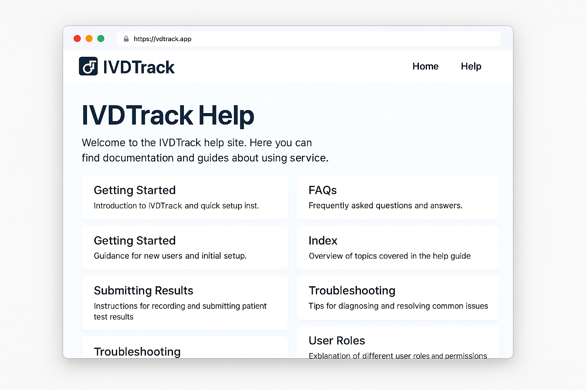

# Getting Started

This page guides you through setting up your IVDTrack account and accessing the dashboard.

## Step 1: Log In
Visit [ivdtrack.app](https://ivdtrack.app) and log in using your lab’s credentials.

## Step 2: Configure Lab Info
- Navigate to **Settings > Lab Profile**
- Add your Lab ID, address, and primary contact
- Upload your IVD compliance certificate (PDF)

## Step 3: Add Users
Only Admins can add users:
1. Go to **Settings > Users**
2. Click **Add New User**
3. Assign role: Admin, Reviewer, or Submitter

